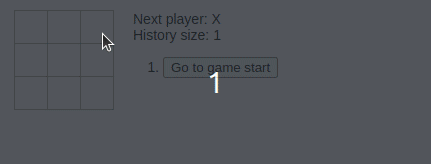
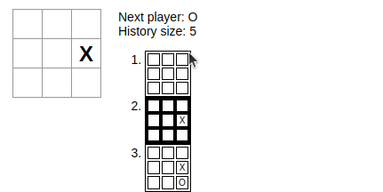
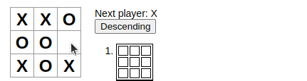
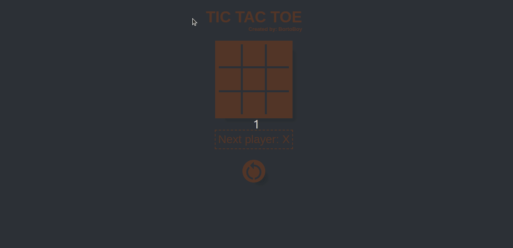
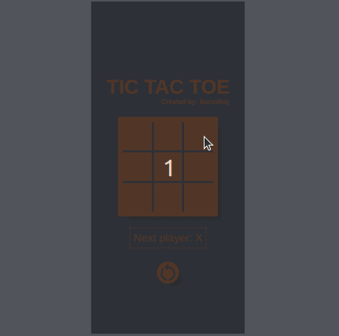

# TIC TAC TOE

## Motivation

This project was created to practice react front end skills. The full tutorial to develop this game using react was provided by reactjs.org at this [link](https://legacy.reactjs.org/tutorial/tutorial.html), please check it out if you want to build your own tic tac toe using react. The tutorial introduces several react functionalities, tools and good practices, like using **state** attribute to let the react js engine to know whenever to update an element in the DOM. The main goal of the tutorial is to create a game as simple as possible, buuut my goal here is to test my front-end skills deeply (this time using react) so I decided to improve the game.

## Development Steps

### 0. Basic Game

First of all I created the game using the reactjs.org [provided tutorial](ttps://legacy.reactjs.org/tutorial/tutorial.html), the result is a simple TIC TAC TOE game, with the most basic appearance.


To make the things funnier I decided to create some improvement tasks and then work on then one by one. The tutorial by it self already suggest a couple of new features to challenge the developers, here they are:

1. Display the location for each move in the format (col, row) in the move history list.
2. Bold the currently selected item in the move list.
3. Rewrite Board to use two loops to make the squares instead of hardcoding them.
4. Add a toggle button that lets you sort the moves in either ascending or descending order.
5. When someone wins, highlight the three squares that caused the win.
6. When no one wins, display a message about the result being a draw.

Beside these additional tasks I decided to create one more task to challenge my basic front-end skills:

7. Apply a beautiful CSS design instead of using a basic one and make it responsible for smaller devices too.

### 1. Improve history display

I removed the history buttons and replaced then by tables, each table is displaying an old game state stored in the history. I applied some extra css to display legible tables.



### 2. Bold selected history

I applied conditional css based on the current history selected state.



### 3. Use loops to generate squares

I removed the static logic generating the Squares and replace it with a logic using two loops, one for rows and one for cols. Look at the snippets:

Old static logic:

```
<div className="board-row">
    {this.renderSquare(0)}
    {this.renderSquare(1)}
    {this.renderSquare(2)}
</div>
<div className="board-row">
    {this.renderSquare(3)}
    {this.renderSquare(4)}
    {this.renderSquare(5)}
</div>
<div className="board-row">
    {this.renderSquare(6)}
    {this.renderSquare(7)}
    {this.renderSquare(8)}
</div>
```

Dynamic new logic:

```
function renderRows(){
    const rows = []
    for (let i = 0; i < 3; i++) {
        const cols = []
        for (let j = 0; j < 3; j++) {
            const squareIndex = j + 3*i
            cols.push(
                <Square
                    key={squareIndex}
                    value={this.props.squares[squareIndex]}
                    onClick={() => this.props.onClick(squareIndex)}
                />
            )
        }
        rows.push(
            <div key={i} className="board-row">
                {cols}
            </div>
        )
        
    }
    return rows
}
```

### 4. Sort moves

I added one more attribute into the game state attribute, the **ascending** attribute, then I created a callback function in a button to toggle this new state property. To change the order from ascending to descending I just used the function [Array.prototype.reverse()](https://developer.mozilla.org/en-US/docs/Web/JavaScript/Reference/Global_Objects/Array/reverse) and to change the automatic numbers inserted by the *ol* html tag I us12
This one is pretty simple, inside the *gameOver* function I added an if statement to check if there is no empty square and nobody won, so the returned value are going to be **draw**:



### 7. Styles

This feature is the most interesting for me. I used styled components to make a better front-end layer to the game. Using flex-box wrap property I was able to implement a simple responsible design, check it out:



For mobile:



I used the **Mobile First** approach, because is easier to implement.

----------------------

Check out the code.
Enjoy :)
